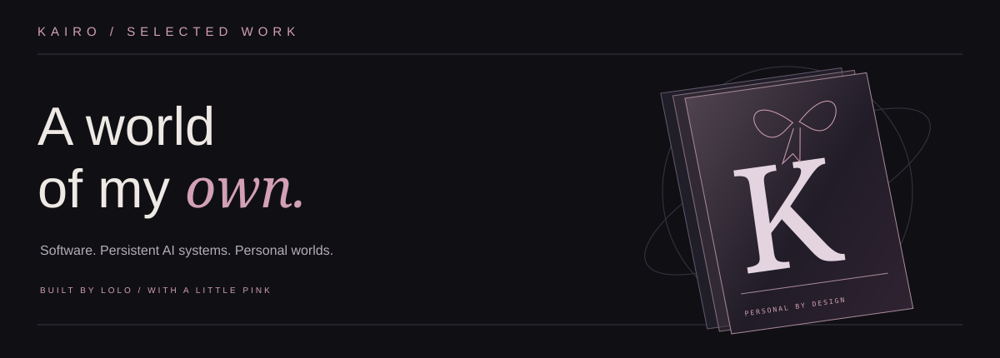
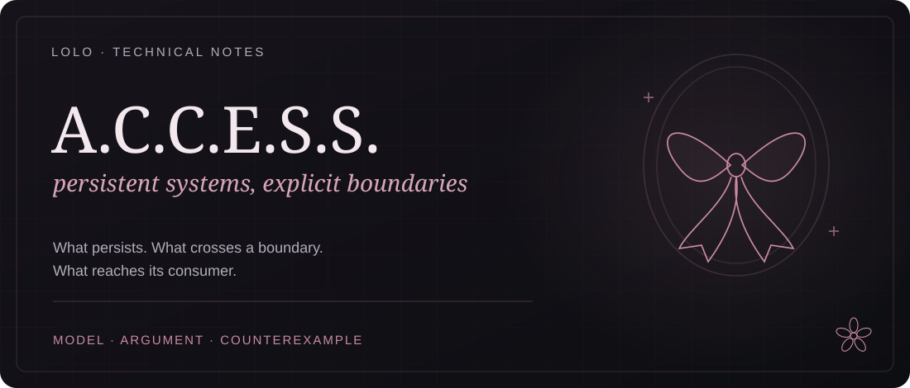
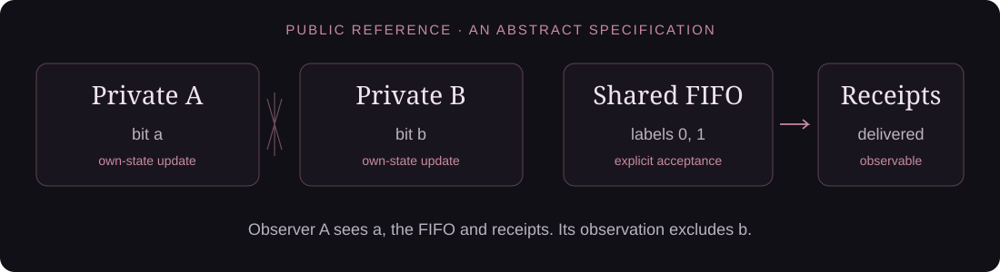

<p align="center"></p>

# Kairo · selected work

Software, persistent AI systems and personal worlds, built by Lolo.

| Project | Public introduction |
| --- | --- |
| **A.C.C.E.S.S.** | A persistent AI ecology exploring individual memory, cognitive dynamics and collective coordination. See the technical notebook below. |
| **[Sayna](https://www.sayna.app/)** | A clinic-branded patient app and management dashboard for aesthetic clinics: loyalty, rewards, bookings and memberships. |
| **Unicorn** | A product in development for discovering technical collaborators through skills, interests and projects. |
| **Maestrale** | A long-term military FPS ambition in Unreal Engine, spanning biomechanics, ballistics and world building. |
| **Tokonoma** | Kairo's personal workspace and interface language: architectural composition, dark ink and dusty rose. |
| **The residence** | An interactive spatial desktop on Arch Linux, under construction. |

The [interactive showcase](https://lolomutekai.github.io/kairo-alcove/) is a self-contained website with a
layered CSS sculpture, pointer perspective and project selection. It is
published on GitHub Pages; GitHub's README renders the static presentation.

---

<p align="center">
  
</p>

# A.C.C.E.S.S. · the public notebook

I am building a personal AI system whose state persists between conversations.
The questions I care about are what one component can learn about another,
whether a published event reaches a consumer, and how state errors propagate.

This notebook works through those questions with an independently written
reference model. The implementation of A.C.C.E.S.S. stays private; the model,
assumptions, proofs and counterexamples here can be examined on their own.

## AI assistance and learning

The writing and reference implementation were developed with AI assistance.
I keep project-specific learning journals, explanations and bug write-ups to
build my own understanding. The assumptions, arguments and executable checks
are available here so the work can be examined directly.

## Start with a question

**Can another component's private state change my observation?**
[Isolation across executions](./notes/01-isolation.md) gives a sufficient
condition for noninterference, with a finite check and a leaking variant.

**Does acceptance imply eventual delivery?**
[Delivery, fairness and starvation](./notes/02-delivery.md) gives a FIFO progress
argument, its scheduler assumption, and a counterexample without that assumption.

**When do small state errors stay small?**
[Perturbation bounds](./notes/03-stability.md) derives a composition bound that
separates initial-state sensitivity from accumulated input error.

## Run the reference model

Python 3.10 or newer; standard library only. From the repository root:

```sh
python3 reference/check.py
python3 reference/check.py --self-test
```

The first command explores every reachable state of the finite model and checks
state integrity, isolation and the delivery condition under weak fairness.
The second also requires the checker to reject three broken variants: a private
state leak, a message silently discarded by its consumer, and a consumer that
is scheduled but never advances. Each rejection includes a reproducible witness.

The checker also prints a valid execution that starves delivery without
fairness. Passing the state checks alone does not remove that execution.
See [the exact model and checking algorithm](./reference/README.md).

## How the pieces fit

<p align="center">
  
</p>

The reference model has two private bits and a bounded FIFO for two labelled
messages. That small domain makes exhaustive inspection possible. It is an
instrument for checking the stated contracts, not a benchmark of the private
system or a model of cognition. [The evidence boundary](./notes/04-evidence.md)
states what would be needed to carry these claims into a running implementation.

## Reading the notebook

Each note starts with a concrete question, defines its symbols, gives the
argument and names a case that defeats a stronger claim. The underlying
results come from established work in formal methods and dynamical systems;
references are placed beside the relevant argument.

There is also a [case from a real public automation](./notes/05-green-job.md):
a successful job whose generated artifact never reached the commit step.
The diagnosis is grounded in the published source and an archived run.

The visual language remains personal: dark ink, dusty rose, small flowers and
a ribbon. The technical claims live in selectable text and runnable files.

<p align="center"><sub>床の間 · a small place for work worth examining · <a href="https://github.com/LoloMutekai">Lolo ♡</a></sub></p>
