<!-- kairo-alcove — the exposed alcove of a sovereign ecosystem. -->

  

 

<h1 align="center">開 &nbsp; the alcove</h1>

  床の間 — in a Japanese room, the single recess where one object is placed, and contemplated. 
  this is the exposed one. <code>the rest lives offline.</code>

 

---

## ⟡ one root sentence

> Personal cognitive sovereignty — owning the means of one's own thinking,
> creating, and dwelling, end to end.

Not a portfolio. A **stance**. Five systems, one ink.

 

## ⟡ the four refusals

A quiet architecture built against four dependencies. Each refusal is a system.
The systems themselves stay in silhouette — *what* matters less than *that they hold*.

| ░ | refusal | the answer |
|---|---|---|
| `01` | **financial** dependence | two systems, kept live |
| `02` | **cognitive** dependence | ▓▓▓▓▓ &nbsp;`classified` — local-first autonomous minds |
| `03` | **creative** dependence | one long-form world, built without a market |
| `04` | **material** dependence | this layer — a sovereign machine, themed by hand · 床の間 |

No links to the private. No names that matter. The shapes are enough.

 

## ⟡ the alcove (床の間)

The desktop is not a junk drawer. It is the **tokonoma** — the recess where what
matters is placed with intention, and everything else is cleared away.

Dark, half-veiled, pierced by a single faded rose. *Yūgen.* The aesthetic is the
argument: respect for the self, expressed through the space one keeps.

 

## ⟡ gallery

The signature works — hand-made SVG, one palette, no template.

| | |
|---|---|
| [`signature-kakemono.svg`](./assets/signature-kakemono.svg) | the hanging scroll · 開 the alcove, the five systems, the sealed mind |

palette — <code>ink #0d0e12</code> · <code>surface #16131a</code> · <code>text #8a93a6</code> · <code>muted #5a6070</code> · <code>tell #c98ba0</code> · <code>cyan #7fb8c8</code>

 

---

  <code>references</code> &nbsp;·&nbsp; <a href="https://www.sayna.app/">sayna.app</a> &nbsp;·&nbsp; <a href="https://github.com/LoloMutekai">the keeper</a> &nbsp;·&nbsp; <code>静寂は空虚ではない</code>

silence is not emptiness.

